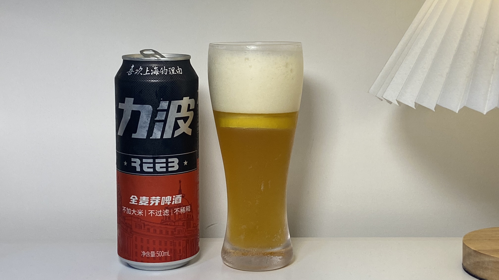
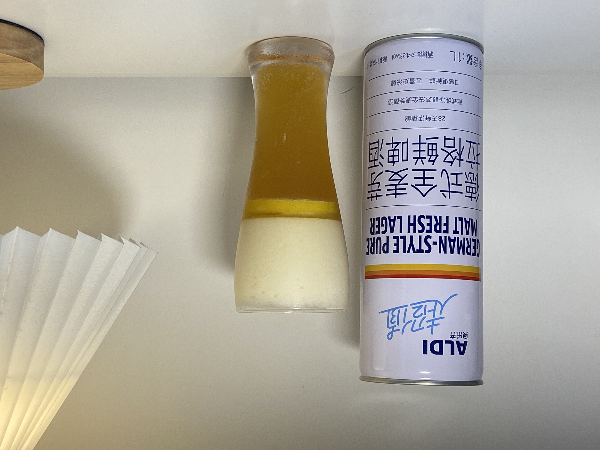
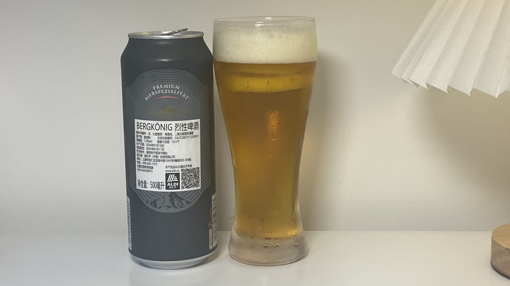

# 一名程序员此生喝过的所有啤酒

## 力波啤酒-红
### 啤酒信息

- 品名：力波全麦芽啤酒·红力波
- 原料：水、麦芽、啤酒花、酵母
- 酒精度：4.1% vol
- 原麦汁浓度：11.0$^\circ$ P
- 条码：6974659850009
- 价格：10 元（路边超市购买）

### 品鉴结果

- 外观：酒体金黄，泡沫丰富绵密
- 香气：麦芽香，酵母香，甜中带酸
- 味道：甜、酸平衡，香气浓郁
- 口感：顺滑，柔中带强，收口清爽，不涩口
- 总体评价：8 分。上海本地啤酒，几乎所有路边超市都有卖，浓郁清爽的口感配得上它的价格，但算不上惊艳。

### 图片展示

## 奥乐齐-全麦拉格啤酒
### 啤酒信息

- 品名：德式全麦芽拉格鲜啤酒（奥乐齐）
- 原料：水、大麦芽、小麦芽、酵母、啤酒花
- 酒精度：4.8% vol
- 原麦汁浓度：12$^\circ$ P
- 条码：6959408002298
- 价格：7.9 元（奥乐齐购买）

### 品鉴信息

- 外观：酒体金黄，泡沫丰富绵密
- 香气：麦芽香，甜香
- 味道：麦芽风味浓郁
- 口感：酒体过于厚重，不够清冽，收口发涩
- 总体评价：6 分。奥乐齐自家推出的啤酒，虽然价格便宜但是口感较差（冰箱放过也一样），不加冰块完全没法喝。

### 图片展示

## BERGKONIG-烈性啤酒
### 啤酒信息

- 品名：BERGKONIG-烈性啤酒（奥地利）
- 原料：水、大麦芽、啤酒花、二氧化碳酒花浸膏
- 酒精度：7.2% vol
- 原麦汁浓度：16.5$\circ$ P
- 条码：4061464598973
- 价格：7.1 元（奥乐齐购买）

### 品鉴信息

- 外观：酒体呈琥珀色，泡沫丰富但消的较快（可能是日期不够新鲜）
- 香气：麦芽香，酒香
- 味道：打开就喝会略微发苦，回温后甜度涌现，酒香和甜香四溢
- 口感：酒体干净，入喉顺畅，酒液不会附着在口腔中，入喉后舌头生津
- 总体评价：8.5 分。在低价位中少见的高麦度啤酒，酒体干净口感清冽，适当回温会激发更多甜香，可以当做小罗斯福来做口粮酒。

### 图片展示

