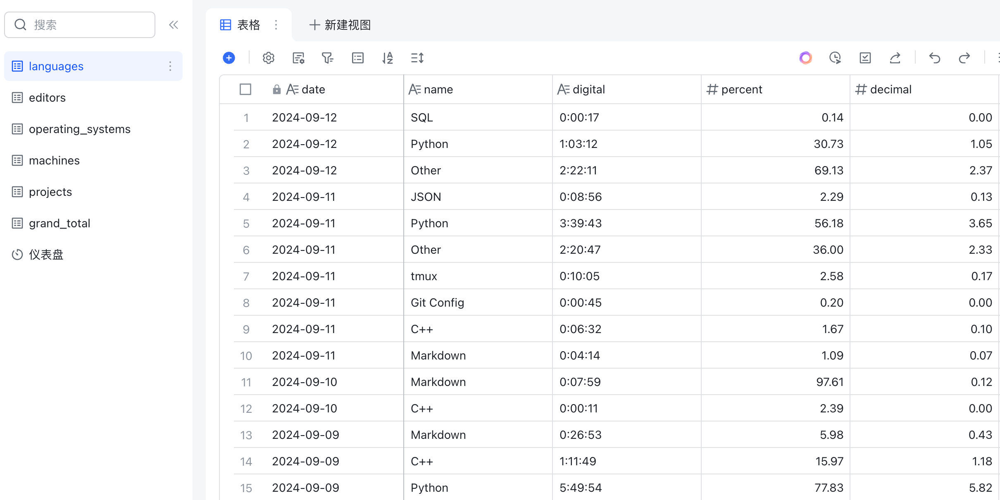

# Wakatime 数据同步到飞书多维表格
## 获取 Wakatime API KEY

访问 [api-key](https://wakatime.com/settings/api-key) 获取 `API-KEY`，相关接口可以查看文档：[developers](https://wakatime.com/developers)。

## 飞书创建多维表格

按照想要的数据创建对应的多维表格：

<div style='display: flex; justify-content: center;'>

</div>

## 飞书构建仪表盘

按照想要的效果构建仪表盘：

<div style='display: flex; justify-content: center;'>

</div>

## Python 脚本调通

需要注意 Wakatime 数据的获取方式，本文采用 `API-KEY` 的方式获取：

```python
WAKATIME_API_KEY = "xxxxxxxxxxxxxxxxxx"
HEADERS = {
    "Authorization": "Basic " + base64.b64encode(WAKATIME_API_KEY.encode("utf-8")).decode("utf-8") + "=",
}
BASE_URL = "https://wakatime.com/api/v1/users/current/summaries"

url = f"{BASE_URL}?start=2024-09-10&end=2024-09-10"
resp = requests.get(url, headers=HEADERS)
```

## 服务器部署
### 定时器和服务器编写

分别编写 `timer` 和 `service` 脚本：

```shell
[Unit]
Description=Wakatime to Feishu

[Timer]
# OnCalendar设置定时规则，这里是每天10点
OnCalendar=*-*-* 10:00:00
Unit=wakatime.service

[Install]
WantedBy=timers.target
```

```shell
[Unit]
Description=Wakatime to Feishu

[Service]
Type=simple
User=castor
# 建议使用 shell 脚本
ExecStart=/home/castor/Wakatime2Feishu/client.sh
```

建议使用 `client.sh` 来启动 `main.py` 脚本，可以避免 `Python` 环境的混乱：

```shell
#!/bin/bash

cd /home/castor/Wakatime2Feishu
python3 main.py
```

### 启用定时任务

```shell
# 复制定时器
sudo cp wakatime.timer /etc/systemd/system/
sudo cp wakatime.service /etc/systemd/system/

# 重载定时任务，启用并开始定时任务
sudo systemctl daemon-reload
sudo systemctl enable wakatime.timer
sudo systemctl start wakatime.timer

# 查看定时任务列表
sudo systemctl list-timers
```