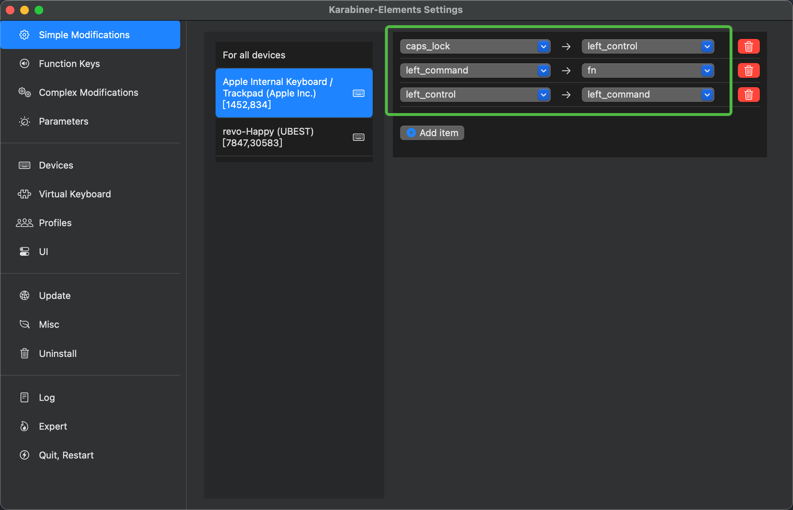
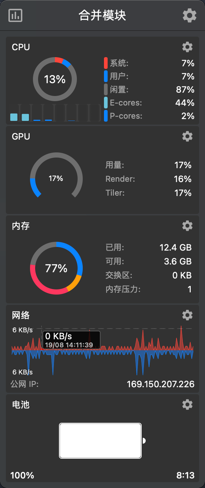

## karabiner

官网链接：[https://karabiner-elements.pqrs.org](https://karabiner-elements.pqrs.org)

MacOs 修改键盘布局软件，可以自定义任意按键。通过这个软件，可以将 MacBook 的键盘修改为 HHKB 配列。下面是配置备份：

### 快捷设置

将 `Control`，`Command` 和 `Fn` 替换：

<div style='display: flex; justify-content: center;'>

</div>

### 脚本配置

设置快捷键：`Fn + JKLI = left, down, right, up`：

```json
{
    "description": "Fn + JKLI = left, down, right, up",
    "manipulators": [
        {
            "from": {
                "key_code": "j",
                "modifiers": {
                    "mandatory": ["fn"],
                    "optional": ["caps_lock", "option", "shift", "control"]
                }
            },
            "to": [{ "key_code": "left_arrow" }],
            "type": "basic"
        },
        {
            "from": {
                "key_code": "k",
                "modifiers": {
                    "mandatory": ["fn"],
                    "optional": ["caps_lock", "option", "shift", "control"]
                }
            },
            "to": [{ "key_code": "down_arrow" }],
            "type": "basic"
        },
        {
            "from": {
                "key_code": "l",
                "modifiers": {
                    "mandatory": ["fn"],
                    "optional": ["caps_lock", "option", "shift", "control"]
                }
            },
            "to": [{ "key_code": "right_arrow" }],
            "type": "basic"
        },
        {
            "from": {
                "key_code": "i",
                "modifiers": {
                    "mandatory": ["fn"],
                    "optional": ["caps_lock", "option", "shift", "control"]
                }
            },
            "to": [{ "key_code": "up_arrow" }],
            "type": "basic"
        },
        {
            "from": {
                "key_code": "o",
                "modifiers": {
                    "mandatory": ["fn"],
                    "optional": ["caps_lock", "option", "shift", "control"]
                }
            },
            "to": [{ "key_code": "end" }],
            "type": "basic"
        },
        {
            "from": {
                "key_code": "u",
                "modifiers": {
                    "mandatory": ["fn"],
                    "optional": ["caps_lock", "option", "shift", "control"]
                }
            },
            "to": [{ "key_code": "home" }],
            "type": "basic"
        },
        {
            "from": {
                "key_code": "spacebar",
                "modifiers": {
                    "mandatory": ["fn"],
                    "optional": ["caps_lock", "option", "shift", "control"]
                }
            },
            "to": [{ "key_code": "delete_or_backspace" }],
            "type": "basic"
        }
    ]
}
```


## Stats

Github 仓库：[https://github.com/exelban/stats](https://github.com/exelban/stats)

在 MacOs 的 Bar 上显示设备信息：CPU、GPU、WLAN 等，配置备份：`/assets/Stats.plist`：

<div style='display: flex; justify-content: center;'>

</div>

## Loop

Github 仓库：[https://github.com/MrKai77/Loop](https://github.com/MrKai77/Loop)

在 MacOs 上快捷移动应用窗口、左右上下贴靠等，配置备份：`/assets/loop.json`：

<div style='display: flex; justify-content: center;'>

</div>
