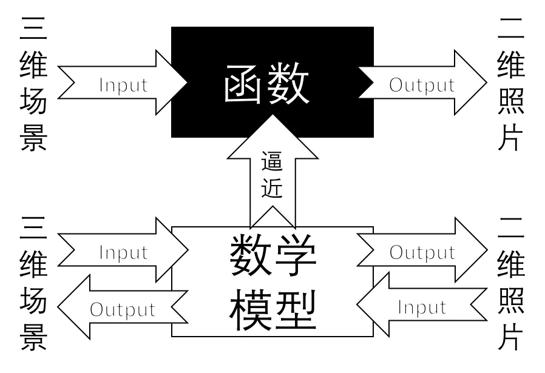
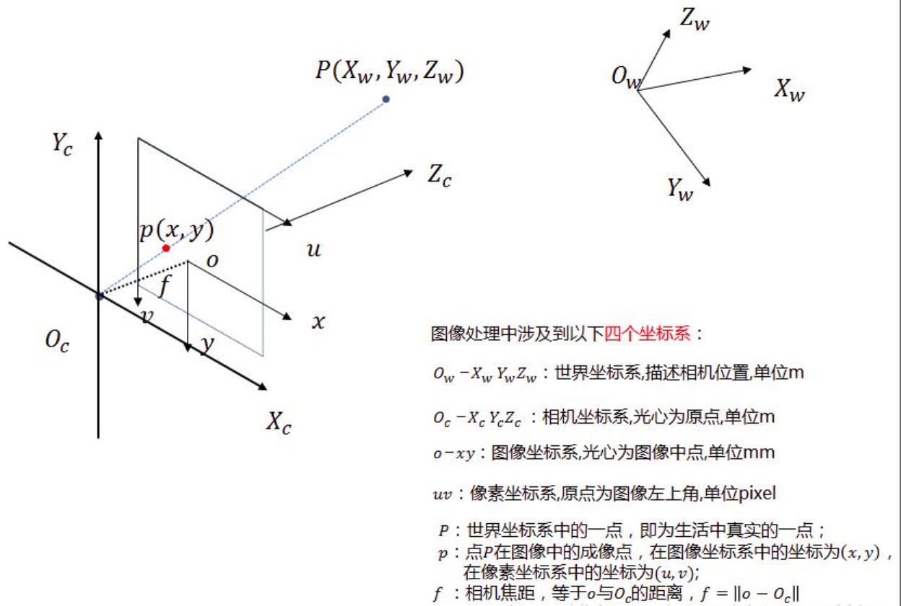
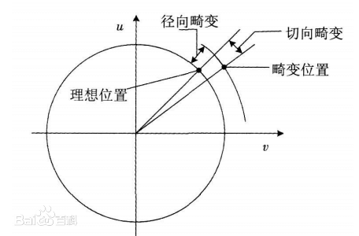
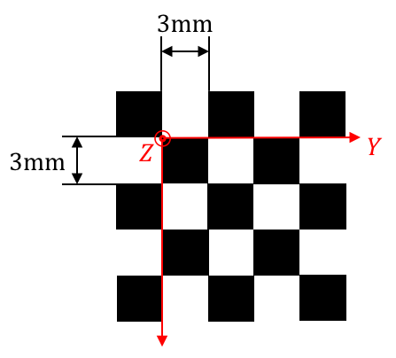

#  由浅到深理解相机标定

## 何为相机标定

在图像测量过程以及机器视觉应用中，为确定空间无哦表面某点的三维几何位置与其在图像中对应点之间的相互关系，必须建立相机成像的几何模型，这些几何模型参数就是相机参数。

在大多数条件下这些参数必须通过实验与计算才能得到，这个求解参数的过程就称之为**相机标定（或摄像头标定）**。

**相机标定**涉及的知识面很广：成像几何、镜头畸变、单应矩阵、非线性优化等。

**相机标定**有自标定（找图像中特征点）、标定板标定（特征点易求，稳定性好），一般采用标定板标定。

**相机标定**按照相机是否静止，可分为静态相机标定（标定板动，相机静止），动态相机标定（标定板静止，相机运动）。

### 为什么需要标定

任何理论物理模型都是在特定假设上对真实事物的近似，然而在实际应用中存在误差，普通相机的成像模型也不例外（透视投影）。

实际中，普通相机成像误差的主要来源有两部分：

- 第一是sensor（传感器）制造产生的误差，比如sensor成像单元不是正方形，sensor歪斜。
- 第二是镜头制造和安装产生的误差，镜头一般存在非线性的径向畸变；镜头与相机sensor安装不平行，还会产生切向畸变。

## 相机标定的目的和意义

我们所处的世界是三维的，而照片是二维的，这样我们可以把相机认为是一个函数，输入量是一个场景，输出量是一幅灰度图。这个从三维到二维的过程的函数是不可逆的。

相机标定的目标是我们找一个合适的数学模型，求出这个模型的参数，这样我们能够近似这个三维到二维的过程，使这个三维到二维的过程的函数找到反函数。

这个逼近的过程就是「相机标定」，我们用简单的数学模型来表达复杂的成像过程，并且求出成像的反过程。标定之后的相机，可以进行三维场景的重建，即深度的感知。

## 相关术语

**焦点：**在几何光学中有时也称为**像点**，是源头的光线经过物镜后汇聚的点。

**焦距：**也称为**焦长**，是光学系统中衡量光的聚集或发散的度量方式，指从透镜中心到光聚集之焦点的距离。亦是照相机中，从镜片光学中心到底片、CCD或CMOS等成像平面的距离。

正透镜、负透镜、凹面镜和凸面镜的焦点`F`和焦距`f`：

**镜头（Lenses）**：是将拍摄景物在传感器上成像的器件，它通常由几片透镜、光圈叶片、对焦马达等光学元件组成。

**传感器（Sensor）**：是摄像头组成的核心，其作用是作为相机的感光元件。摄像头传感器主要有两种，一种是CCD传感器，一种是CMOS传感器，两者区别在于：CCD的优势在于成像质量好，但是由于制造工艺复杂，成本居高不下，特别是大型CCD，价格非常高昂。在相同分辨率下，CMOS价格比CCD便宜，但是CMOS器件产生的图像质量相比CCD来说要低一些。

**光心**：凸透镜近轴光线中，入射线和与其对应且相平行的出射线构成共轭光线，其入射点跟出射点的连线与主光轴的交点，称为凸透镜的焦点，位于透镜中央的点叫光心。

从图中可知，`O`为光心，`F`为焦点。每个透镜主轴上都有一个特殊点，凡是通过该点的光，其传播方向不变，这个点叫光心。经过光心的光线的传播方向不会发生改变。

## 相机标定原理模型

### 针孔相机模型

我们通常将相机看成如下所示的透镜模型：

在实际分析时，通常将其简化为针孔模型（小孔成像）：

一般为了分析简单，将成像平面画在对称位置，这样图像不再颠倒：

### 四个坐标系

**世界坐标系**：用户定义的三维世界的坐标系，用于描述目标物体在真实世界里的位置。单位通常为米（m）。该坐标系作用于三维空间。

**相机坐标系**：在相机上建立的坐标系，为了从相机的角度描述物体位置而定义，作为沟通世界坐标系和图像/像素坐标系的中间一环。单位通常为米（m）。相机坐标系的原点在光心，其 $X_c、Y_c$ 轴分别与像面的两边平行，其 $Z_c$ 轴与光轴重合，且垂直于图像坐标系平面并通过图像坐标系的原点（实际情况中可能存在**主点偏移**），相机坐标系与图像坐标系之间的距离为焦距 $f$。该坐标系作用于三维空间。

**图像坐标系**：为了描述成像过程中物体从相机坐标系到图像坐标系的投影投射关系而引入，方便进一步得到像素坐标系下的坐标。其原点是相机光轴与像面的交点（称为主点），即**图像的中心点**。其 $x, y$ 轴和像素坐标系的 $u, v$ 轴平行，故图像坐标系和像素坐标系实际是平移关系。单位通常为毫米（mm）。该坐标系作用于二维空间。

**像素坐标系**：为了描述物体成像后的像点在数字图像上（相片）的坐标而引入，是我们真正从相机内读取到的信息所在的坐标系。单位为像素。像素坐标平面和图像坐标系平面重合，但像素坐标系原点位于图像左上角。该坐标系作用于二维空间。

### 相机外参

将世界坐标系中的点映射到相机坐标系：相机坐标系是世界坐标系通过**刚体变换**得到的。

> 刚体变换能够保持物体中各点的距离和角度，常见的刚体变换有：平移、旋转和镜像。

我们先只考虑旋转，假设将坐标系以 $X$ 轴为中心进行旋转，即 $X$ 不变，旋转 $Y - Z$ 平面。

假设旋转角度为 $\theta$，即 $\angle Y' O Y = \angle Z' O Z = \theta$。旋转前的坐标系为 $X - Y - Z$，旋转后的坐标系为 $X' - Y' - Z'$。假设点 $P$ 在 $X - Y - Z$ 中的坐标为（$X_w, Y_w, Z_w$），旋转后，其在 $X' - Y' - Z'$ 中的坐标为（$X_c, Y_c, Z_c$）：
$$
X_C = X_w
$$

$$
\begin{array}{l}
 Y_c & = OC + CD = OA \cdot \sin \theta + BP \\\\
  & = Z_w \cdot \sin \theta + AP \cdot \cos \theta \\\\
  & = Z_w \sin \theta + Y_w \cos \theta
\end{array}
$$

$$
\begin{array}{l}
 Z_c & = PD = AC - AB \\\\
  & = AO \cdot \cos \theta - AP \cdot \cos \theta \\\\
  & = Z_w \cos \theta + Y_w \cos \theta
\end{array}
$$

写成矩阵形式：
$$\displaystyle \begin{bmatrix} X_c \\\\ Y_c \\\\ Z_c \end{bmatrix} = \mathbf{R_{cw}} \begin{bmatrix} X_w \\\\ Y_w \\\\ Z_w \end{bmatrix} or \begin{bmatrix} X_w \\\\ Y_w \\\\ Z_w \end{bmatrix} = \mathbf{R_{wc}} \begin{bmatrix} X_c \\\\ Y_c \\\\ Z_c \end{bmatrix} $$
推广到每个方向，可得到 $\mathbf{R_{cw}}, \mathbf{R_{wc}}$ 为：
$$
\mathbf{R_{cw}} (X_A, \theta) = 
\begin{bmatrix}
 1 & 0 & 0 \\\\
 0 & \cos \theta & \sin \theta \\\\
 0 & - \sin \theta & \cos \theta
\end{bmatrix}
,
\mathbf{R_{wc}} (X_A, \theta) = 
\begin{bmatrix}
 1 & 0 & 0 \\\\
 0 & \cos \theta & - \sin \theta \\\\
 0 & \sin \theta & \cos \theta
\end{bmatrix}
$$
$$
\mathbf{R_{cw}} (Y_A, \theta) = 
\begin{bmatrix}
 \cos \theta & 0 & \sin \theta \\\\
 0 & 1 & 0 \\\\ - \sin \theta & 0 & \cos \theta
\end{bmatrix}
,
\mathbf{R_{wc}} (Y_A, \theta) = 
\begin{bmatrix}
 \cos \theta & 0 & - \sin \theta \\\\
 0 & 1 & 0 \\\\
 \sin \theta & 0 & \cos \theta
\end{bmatrix}
$$
$$
\mathbf{R_{cw}} (Z_A, \theta) = 
\begin{bmatrix}
 \cos \theta & \sin \theta & 0 \\\\ - \sin \theta & \cos \theta & 0 \\\\
 0 & 0 & 1
\end{bmatrix}
,
\mathbf{R_{wc}} (Z_A, \theta) = 
\begin{bmatrix}
 \cos \theta & - \sin \theta & 0 \\\\
 \sin \theta & \cos \theta & 0 \\\\
 0 & 0 & 1
\end{bmatrix}
$$

这里我们使用右手笛卡尔三维坐标系：

旋转可分为**主动旋转**与**被动旋转**。**主动旋转**是指将向量逆时针围绕旋转轴所做出的旋转。**被动旋转**是对坐标轴本身进行的逆时针旋转，它相当于主动旋转的逆操作。关于右手笛卡尔坐标系的 $X, Y, Z$ 轴的旋转分别叫做`roll`，`pitch`和`yaw`旋转：

因为逆时针和顺时针旋转会得到不一样的旋转矩阵，所以我们统一如下：

绕 $X$ 轴的主动旋转定义为（$\theta_x$ 是`roll`角 ）：
$$
R(X_A, \theta_x) = 
\begin{bmatrix}
 1 & 0 & 0 \\\\
 0 & \cos \theta_x & - \sin \theta_x \\\\
 0 & \sin \theta_x & \cos \theta_x
\end{bmatrix} =
\exp \left ( \theta_x
\begin{bmatrix}
 0 & 0 & 0\\\\
 0 & 0 & -1\\\\
 0 & 1 & 0
\end{bmatrix}
 \right )
$$
绕 $Y$ 轴的主动旋转定义为（$\theta_y$ 是`pitch`角）：
$$
R(Y_A, \theta_y) = 
\begin{bmatrix}
 \cos \theta_y & 0 & \sin \theta_y \\\\
 0 & 1 & 0 \\\\ - \sin \theta_y & 0 & \cos \theta_y
\end{bmatrix} =
\exp \left ( \theta_y
\begin{bmatrix}
 0 & 0 & 1\\\\
 0 & 0 & 0\\\\ -1 & 0 & 0
\end{bmatrix}
 \right )
$$
绕 $Z$ 轴的主动旋转定义为（$\theta_z$ 是`yaw`角）：
$$
R(Z_A, \theta_z) = 
\begin{bmatrix}
 \cos \theta_z & - \sin \theta_z & 0 \\\\
 \sin \theta_z & \cos \theta_z & 0 \\\\
 0 & 0 & 1
\end{bmatrix} =
\exp \left ( \theta_y
\begin{bmatrix}
 0 & -1 & 0\\\\
 1 & 0 & 0\\\\
 0 & 0 & 0
\end{bmatrix}
 \right )
$$
将上述三个旋转矩阵结合起来，最终的旋转矩阵（设绕 $X, Y, Z$ 轴旋转的角度分别为 $\alpha, \beta, \gamma$）：
$$
\begin{array}{ll}
 M(\alpha, \beta, \gamma) & = R_x(\alpha) R_y(\beta) R_z(\gamma) \\\\
  & = 
\begin{bmatrix}
 1 & 0 & 0 \\\\
 0 & \cos \alpha & - \sin \alpha \\\\
 0 & \sin \alpha & \cos \alpha 
\end{bmatrix}
\begin{bmatrix}
 \cos \beta  & 0 & \sin \beta  \\\\
 0 & 1 & 0 \\\\ - \sin \beta  & 0 & \cos \beta 
\end{bmatrix}
\begin{bmatrix}
 \cos \gamma & -\sin \gamma & 0 \\\\
 \sin \gamma & \cos \gamma & 0 \\\\
 0 & 0 & 1
\end{bmatrix} \\\\
 & = \begin{bmatrix}
 \cos \gamma \cos \beta & - \sin \gamma \cos \alpha + \cos \gamma \sin \beta \sin \alpha & \sin \gamma \sin \alpha + \cos \gamma \sin \beta \cos \alpha \\\\
 \sin \gamma \cos \beta & \cos \gamma \cos \alpha + \sin \gamma \sin \beta \sin \alpha & - \cos \gamma \sin \alpha + \sin \gamma \sin \beta \cos \alpha \\\\ - \sin \beta & \cos \beta \sin \alpha & \cos \beta \cos \alpha 
\end{bmatrix}
\end{array}
$$

此时我们再加上平移向量 $T$ 便可完成从世界坐标系到相机坐标系的这个刚体变换了：

$$
\begin{bmatrix}
X_c \\\\
Y_c \\\\
Z_c
\end{bmatrix} =
\begin{bmatrix}
 r_{11} & r_{12} & r_{13} \\\\
 r_{21} & r_{22} & r_{23} \\\\
 r_{31} & r_{32} & r_{33}
\end{bmatrix}
\begin{bmatrix}
X_w \\\\
Y_w \\\\
Z_w
\end{bmatrix} +
\begin{bmatrix}
t_x \\\\
t_y \\\\
t_z
\end{bmatrix} =
\mathbf{R}
\begin{bmatrix}
X_w \\\\
Y_w \\\\
Z_w
\end{bmatrix} + T
$$

可进一步写成如下形式：

$$
\begin{bmatrix}
X_c \\\\
Y_c \\\\
Z_c \\\\
1
\end{bmatrix} =
\begin{bmatrix}
\mathbf{R} & \mathbf{T} \\\\
 0_3^T & 1
\end{bmatrix}
\begin{bmatrix}
X_w \\\\
Y_w \\\\
Z_w \\\\
1
\end{bmatrix}
$$

其中，$\mathbf{R}$ 和 $\mathbf{T}$ 便是相机外参。

### 相机内参

首先考虑图像坐标系（$xy$）和像素坐标系（$uv$）之间的转换：

$$
\begin{bmatrix}
u \\\\
v \\\\
1
\end{bmatrix}=
\begin{bmatrix}
\displaystyle \frac{1}{dx} & 0 & u_0 \\\\
0 & \displaystyle \frac{1}{dy} & v_0 \\\\
0 & 0 & 1
\end{bmatrix}=
\begin{bmatrix}
x \\\\
y \\\\
1
\end{bmatrix}
$$

$dx$ 表示一个像素点在 $x$ 方向的长度是多少毫米，$dy$ 表示一个像素点在 $y$ 方向的长度是多少毫米；$(u_0, v_0)$ 为图像的中心点。

然后考虑相机坐标系和图像坐标系之间的转换：

$$
\Delta ABO_c \sim \Delta oCO_c, \Delta PBO_c \sim \Delta pCO_c
$$
$$
\displaystyle \frac{AB}{oC} = \frac{AO_c}{oO_c} = \frac{PB}{p C} = \frac{X_c}{x} = \frac{Z_c}{f} = \frac{Y_c}{y}
$$
$$
x = f \displaystyle \frac{X_c}{Z_c}, y = f \frac{Y_c}{Z_c}
$$

$$
Z_c \begin{bmatrix}
x \\\\
y \\\\
1
\end{bmatrix}=
\lambda 
\begin{bmatrix}
u \\\\
v \\\\
1
\end{bmatrix}=
\begin{bmatrix}
 f & 0 & 0 & 0 \\\\
 0 & f & 0 & 0 \\\\
 0 & 0 & 1 & 0
\end{bmatrix}
\begin{bmatrix}
X_c \\\\
Y_c \\\\
Z_c \\\\
1
\end{bmatrix}
$$

其中，$f$ 是焦距，结合外参我们最终可以得到世界坐标系和像素坐标系之间的映射关系：

$$
\begin{array}{l}
\lambda \begin{bmatrix}
u \\\\
v \\\\
1
\end{bmatrix} & =
\begin{bmatrix}
\displaystyle \frac{1}{dx} & 0 & u_0 \\\\
0 & \displaystyle \frac{1}{dy} & v_0 \\\\
0 & 0 & 1
\end{bmatrix}
\begin{bmatrix}
 f & 0 & 0 & 0 \\\\
 0 & f & 0 & 0 \\\\
 0 & 0 & 1 & 0
\end{bmatrix}
\begin{bmatrix}
\mathbf{R} & \mathbf{T} \\\\
 0 & 1
\end{bmatrix}
\begin{bmatrix}
X_w \\\\
Y_w \\\\
Z_w \\\\
1
\end{bmatrix}\\\\
  & =
\begin{bmatrix}
 fx & 0 & u_0 & 0 \\\\
 0 & fy & v_0 & 0 \\\\
 0 & 0 & 1 & 0
\end{bmatrix}
\begin{bmatrix}
\mathbf{R} & \mathbf{T} \\\\
 0 & 1
\end{bmatrix}
\begin{bmatrix}
X_w \\\\
Y_w \\\\
Z_w \\\\
1
\end{bmatrix}
\end{array}
$$
其中，相机内参为（不考虑图像传感器的特性）：
$$
\begin{bmatrix}
 fx & 0 & u_0 & 0 \\\\
 0 & fy & v_0 & 0 \\\\
 0 & 0 & 1 & 0
\end{bmatrix}
$$

其中，$f_x, f_y$ 即为焦距的物理距离在像素坐标系中的长度，相机内参标定主要是标定相机的焦距、主点、歪斜等内部参数。

## 可能存在的影响

### 主点偏移

主点是光轴和相机成像平面的交点，在理想情况下，图像坐标系和相机坐标系原点重合，不存在坐标系偏移。但在实际情况中，图像坐标系往往在图片的左上角，光轴过图像中心，因此图像坐标系和相机坐标系不重合。两个坐标系之间存在一个平移运动：

    

考虑主点偏移后，图像坐标和3D在相机坐标系的关系为：

$$
\begin{matrix}
u = f \frac{X}{Z} + O_x \\\\
v = f \frac{X}{Z} + O_y
\end{matrix}
$$
此时，透视投影模型（像素坐标系和相机坐标系）的关系为：
$$
\lambda 
\begin{bmatrix}
u \\\\
v \\\\
1
\end{bmatrix} =
\begin{bmatrix}
 f & 0 & O_x & 0 \\\\
 0 & f & O_x & 0 \\\\
 0 & 0 & 1 & 0
\end{bmatrix}
\begin{bmatrix}
X_c \\\\
Y_c \\\\
Z_c \\\\
1
\end{bmatrix}
$$

仔细观察就会发现，该关系与上面提到的关系是等价的，只不过上面使用坐标 $(u_0, v_0)$ 来代表偏移量 $(O_x, O_y)$。

### 图像传感器特征

图像传感器像原尺寸在制造过程可能不是正方形，同时可能存在歪斜（skewed），因此需要考虑这些影响因素，传感器歪斜和不是正方形主要对相机 $x$ 和 $y$ 方向的焦距产生影响。

此时，透视投影模型（像素坐标系和相机坐标系）的关系为：
$$
\lambda 
\begin{bmatrix}
u \\\\
v \\\\
1
\end{bmatrix} =
\begin{bmatrix}
 f & s & O_x & 0 \\\\
 0 & \eta f & O_x & 0 \\\\
 0 & 0 & 1 & 0
\end{bmatrix}
\begin{bmatrix}
X_c \\\\
Y_c \\\\
Z_c \\\\
1
\end{bmatrix} = [K, 0_3] P
$$
其中，$K$ 矩阵即为最终的内参矩阵。

### 镜头畸变

小孔成像模型虽然充分考虑了相机内部参数对成像的影响，但没有考虑成像系统另一个重要的部分，镜头。镜头常用的有普通镜头、广角镜头、鱼眼镜头等，在无人驾驶和视觉slam领域，鱼眼镜头和广角镜头用的很多，主要是视角很大，可以观测到更多的信息。任何镜头都存在不同程度的畸变，不同类型的镜头用到的畸变模型也不相同。

在几何光学和阴极射线管（CRT）显示中，畸变（distortion）是对直线投影的一种偏移。简单来说直线投影是场景内的一条直线投影到图片上也保持为一条直线。那畸变简单来说就是一条直线投影到图片上不能保持为一条直线了，这是一种光学畸变。畸变一般可以分为两大类，包括**径向畸变（radial distortion）**和**切向畸变（tangential distortion）**。

径向畸变来自于透镜形状，主要是由于透镜不同部位放大倍率不同造成的。切向畸变来自于整个相机的组装过程，主要是由于透镜安装与成像平面不平行造成的。

#### 径向畸变

透过镜头边缘的光线很容易产生径向畸变，这种现象来源于“筒形”或“鱼眼”的影响。光线离镜头中心越远，畸变越大。

从图像可以看出，径向畸变以某一个中心往外延伸，且越往外，畸变越大；显然畸变与距离成一种非线性的变换关系，参考众多文献，可以用多项式来近似：
$$
\begin{matrix}
x_{rcrt} = x(1 + k_1 r^2 + k_2 r^4 + k_3 r^6) \\\\\\\\
y_{rcrt} = y(1 + k_1 r^2 + k_2 r^4 + k_3 r^6) 
\end{matrix}
$$
其中，$x, y$ 是归一化的图像坐标，即坐标原点已经移动到主点，并且像素坐标除以焦距。$k_1, k_2, k_3$ 是径向畸变系数，$r^2 = x^2 + y^2$。

#### 切向畸变

切向畸变主要发生在相机sensor和镜头不平行的情况下；因为有夹角，所以光透过镜头传到图像传感器上时，成像位置发生了变化。

$$
\begin{matrix}
x_{tcrt} = x + [2p_1 xy + p_2 (r^2 + 2 x^2)] \\\\\\\\
y_{tcrt} = y + [2p_2 xy + p_1 (r^2 + 2 y^2)]
\end{matrix}
$$
其中，$x, y$ 是归一化的图像坐标，即坐标原点已经移动到主点，并且像素坐标除以焦距。$p_1, p_2$ 是切向畸变系数，$r^2 = x^2 + y^2$。

### 消除镜头畸变

考虑镜头畸变前，我们可以将相机标定简单描述为以下过程：像素坐标 $(u_{ccd}, v_{ccd})$ $\to$ 图像坐标 $(x, y)$ $\to$ 相机坐标 $(X_c, Y_c, Z_c)$ $\to$ 世界坐标 $(X_w, Y_w, Z_w)$。

此时我们考虑加入镜头畸变：
$$
\begin{matrix}
x_{crt} = x_{rcrt} + x_{tcrt} \\\\\\\\
y_{crt} = y_{rcrt} + y_{tcrt}
\end{matrix}
$$
得到消除镜头畸变的相机标定流程：像素坐标 $(u_{ccd - crt}, v_{ccd - crt})$ $\to$ 图像坐标 $(x_{crt}, y_{crt})$ $\to$ 相机坐标 $(X_c, Y_c, Z_c)$ $\to$ 世界坐标 $(X_w, Y_w, Z_w)$。

## 标定板的作用

### 相机标定中的参数

针孔相机模型中，只要确定这9个参数就可以唯一的确定针孔相机模型：

$$
f_x,f_y,O_x,O_y,k_1,k_2,k_3,p_1,p_2
$$

这个过程就称为「相机标定」，其中前4个我们称为内参数，后5个称为畸变参数，畸变参数是为了补充内参的。所以一旦相机结构固定，包括镜头结构固定，对焦距离固定，我们就可以用这9个的参数去近似这个相机。这里说的「镜头结构固定」，按我个人的理解，除了焦距固定之外，也应当包含光圈固定，因为改变光圈的大小，除了景深之外，是有可能改变针孔相机模型中的光心位置，但是影响并不是很大。这意味着标定好的相机如果改变光圈大小，会使得标定误差变大但应该不会大到难以接受的地步。

对于针孔相机本身需要拟合的方程如下：

$$
\begin{bmatrix}
u_{ccd - crt} * Z\\\\
v_{ccd - crt} * Z\\\\
Z
\end{bmatrix} =
J(k_1, k_2, k_3, p_1, p_2)
\begin{bmatrix}
 f_x & 0 & O_x \\\\
 0 & f_y & O_y \\\\
 0 & 0 & 1
\end{bmatrix}
\begin{bmatrix}
X \\\\
Y \\\\
X
\end{bmatrix}
$$

因此，我们现在的任务就是找出一大堆具有对应关系的像点 $\{(u_{ccd - crt}, v_{ccd - crt}) ^T \}$ 和物点 $\{ (X, Y, Z)^T \}$ 的点作为样本，来训练出模型的参数。这里就引发了两个问题：

- 这么多像点和物点如何匹配？
- 即便现在知道物点的位置，如何用相机坐标系来表达物点的位置 $(X, Y, Z)$？

为了解决上述问题，标定板应运而生。标定板的一大作用，确定物点和像点的对应性。这里用到的原理主要是「透视不变性」，打个比方，你近看一个人和远看一个人，虽然他的鼻子大小变了，你看鼻子的视角也变了，但是拓扑结构肯定是不变的，你也不可能把鼻子看成是嘴巴。

所以在标定板中，印刷了拓扑结构，广泛应用的是棋盘格和圆点格，这两种之所以成为主流，不仅是因为它们的拓扑结构明确且均匀，更重要的是检测其拓扑结构的算法简单且有效。棋盘格检测的是角点，只要对拍摄到的棋盘格图像横纵两个方向计算梯度就可获得；而圆点格的检测只需要对拍摄到的圆点格图样计算质心即可。假如你开发了一套非常完美的检测人脸全部特征的算法，你完全可以用你的照片当作标定板。

按照我的经验，圆点格的效果应该是好于棋盘格，因为圆点质心的「透视不变性」要比棋盘格的角点稳定的多。下图是同样尺寸、同样比例棋盘格和圆点在最大重投影误差处的误差对比，红色十字是提取的角点/质心，绿色圆圈是针孔相机模型计算出来认为的角点/质心位置。

但是圆点格的检测似乎是Halcon的专利（存疑），因此OpenCV和Matlab标定工具箱用的是棋盘格，要用圆点格得要自己写算法。下文中提到的标定板说的都是棋盘格。

标定板的第二大作用是把标定板中的角点变换到相机坐标系下的坐标 $(X, Y, Z)$。对于标定的初学者来说，很容易忽略的一点是标定板是具有标定板坐标系的。换句话说，标定板中的每个角点，在标定板坐标系下的位置是确定并且是已知的。

而标定板坐标系变换到相机坐标系的变换矩阵，我们称它的元素为外参数。

### 如何使用标定板

如果用OpenCV或Matlab标定工具箱进行标定，需要给出棋盘格的物理尺寸，这其实就是在建立标定板坐标系，从测量的角度讲，标定板的精度是相机标定精度的基准，是误差传递链上的第一个环节。所以为了使针孔相机模型更逼近真实相机，对标定板的质量有以下要求（按重要性顺序）：

- 标定板的平面度高，棋盘格是直角。
- 标定板每个格子尺寸的高一致性。
- 真实尺寸与标称尺寸的差异小。
